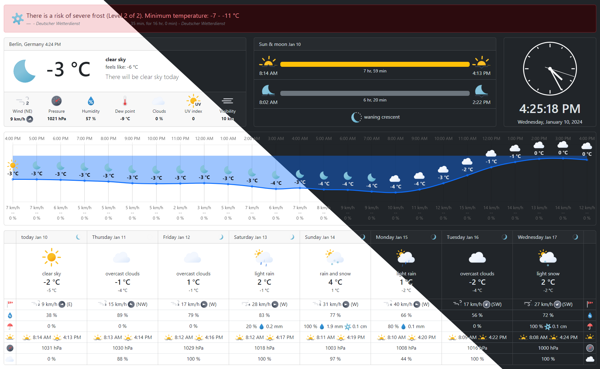

# WeatherDashboard

A beautiful weather display for html kiosks. Made for [OpenWeatherMap](https://openweathermap.org/) with [Angular](https://github.com/angular/angular), [Bootstrap](https://github.com/twbs/bootstrap), [Chart.js](https://github.com/chartjs/Chart.js) and the very beautiful and animated [basmilius / weather-icons](https://github.com/basmilius/weather-icons). ❤

## Why?

I used the [vlane / Weather-Forecast-Dashboard](https://github.com/vlaine/Weather-Forecast-Dashboard) for many years on a Raspberry Pi and liked it a lot! But because I wanted to learn Angular and to have little more decent and modern design, I started to code my own interpretation of a weather kiosk. Hope you like it.

## Usage

Grab the latest version from the releases page, change settings in `assets/config.json` to what you like and make everything available for a current browser of your choice.

### Language / Localization

Currently english and german is supported out of the box, but feel free to add your prefered language. In the `assets/locale` directory you can find the language files. Copy and translate the `en.json` to your language (ISO 2-digits language code) and refer to your code in `language` inside `config.json`. Your language code must be a 'real' one, because it is also used for the OpenWeatherMap API and JS Intl API.
Because Angulars built in I18n tools are very complex in my oppinion, I didn't used it all. It is not possible to add another locale after building. That's why I used this json approach.

## Questions / Help?

Just feel free to ask or post an issue, I try my best.

## Development

This is a very basic Angular project, no rocket science used. Just feel free to fork, `npm install`, `ng serve` and make pull requests, I would love to see what (else) is possible or better with Angular. ;-)
